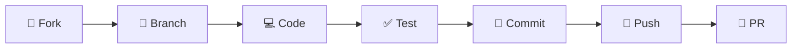

<div align="center">
  <h1>🐝 HelpHive</h1>
</div>

<div align="center">

### ⚡ *Streamline Your Customer Support Like Never Before* ⚡

*A comprehensive support platform designed for small businesses to manage customer inquiries and support tickets with elegance and efficiency.*

[](https://github.com/Rajibkd1/HelpHive)
[](LICENSE)
[](https://php.net)
[](https://mysql.com)
[](https://laravel.com)

</div>

---

## 🌟 What Makes HelpHive Special?

<table>
<tr>
<td width="50%">

### 🎯 **Smart Ticket Management**
Effortlessly create, track, and resolve customer support tickets with our intuitive CRUD system that keeps everything organized.

### 🔐 **Secure OTP Authentication**
Rock-solid security with email-based OTP verification ensuring only legitimate users access your support platform.

</td>
<td width="50%">

### 📊 **Real-Time Status Tracking**
Never lose track of ticket progress with our dynamic status system: Open → In Progress → Resolved.

### 🎨 **Beautiful UI/UX**
Modern, responsive design built with Tailwind CSS that looks stunning on any device.

</td>
</tr>
</table>

---

## 🛠️ Tech Stack & Architecture

<div align="center">

| **Frontend** | **Backend** | **Database** | **Authentication** |
|:------------:|:----------:|:------------:|:------------------:|
|   |  |  |  |
|   |  |  |  |

</div>

---

## 🚀 Quick Start Guide

### 📋 Prerequisites

Before diving in, make sure you have:

```bash
✅ PHP 7.4 or higher
✅ Composer (latest version)
✅ Laravel CLI
✅ MySQL 5.7+
✅ Your favorite code editor
```

### ⚡ Lightning-Fast Installation

```bash
# 1️⃣ Clone the magic
git clone https://github.com/Rajibkd1/HelpHive.git
cd HelpHive

# 2️⃣ Install dependencies
composer install

# 3️⃣ Environment setup

# 4️⃣ Generate app key
php artisan key:generate

# 5️⃣ Database migration
php artisan migrate

# 6️⃣ Launch! 🚀
php artisan serve
```

### 🔧 Database Configuration

Update your `.env` file with your database credentials:

```env
# Database Configuration
DB_CONNECTION=mysql
DB_HOST=127.0.0.1
DB_PORT=3306
DB_DATABASE=helphive
DB_USERNAME=your_username
DB_PASSWORD=your_password
```

---

## 💎 Features That Shine

<div align="center">

| Feature | Description | Status |
|---------|-------------|--------|
| 🎫 **Ticket Management** | Complete CRUD operations for support tickets | ✅ Ready |
| 🔐 **OTP Authentication** | Email-based verification system | ✅ Ready |
| 📈 **Status Tracking** | Real-time ticket status updates | ✅ Ready |
| 📱 **Responsive Design** | Mobile-first, beautiful UI | ✅ Ready |
| 🚀 **Performance** | Optimized Laravel backend | ✅ Ready |
| 🔍 **Search & Filter** | Advanced ticket searching | ✅ Ready |
| 📊 **Analytics Dashboard** | Insights and reporting | ✅ Ready |
| 🌐 **Multi-language** | International support | 🚧 Coming Soon |

</div>

---

## 🎯 How to Use HelpHive

### For Customers 👥
1. **Register** → Verify email with OTP → **Access granted!**
2. **Create tickets** → Describe your issue → **Submit**
3. **Track progress** → Get real-time updates → **Issue resolved!**

### For Support Teams 🛠️
1. **Admin login** → Dashboard access
2. **View tickets** → Prioritize and assign
3. **Update status** → Communicate with customers
4. **Resolve efficiently** → Happy customers! 😊

---

## 🤝 Contributing to HelpHive

We ❤️ contributions! Here's how you can help make HelpHive even better:

<div align="center">

### 🌟 **Contribution Workflow**



</div>

```bash
# 1. Fork the repository on GitHub
# 2. Clone your fork
git clone https://github.com/YOUR_USERNAME/HelpHive.git

# 3. Create a feature branch
git checkout -b feature/amazing-new-feature

# 4. Make your changes and commit
git commit -m "✨ Add amazing new feature"

# 5. Push to your branch
git push origin feature/amazing-new-feature

# 6. Open a Pull Request
```

---

## 📄 License

<div align="center">

**HelpHive** is open source software licensed under the **MIT License**.

[](https://opensource.org/licenses/MIT)

*Feel free to use, modify, and distribute as you wish!*

</div>

---

## 🙏 Acknowledgements & Credits

<div align="center">

### 👨‍💻 **Meet the Creator**

<table>
<tr>
<td align="center">
<br>
<sub><b>Rajib Kumar Dhar</b></sub><br>
<a href="https://github.com/Rajibkd1">🐙 GitHub</a> • 
<a href="mailto:rrajibkd@gmail.com">📧 Email</a>
</td>
</tr>
</table>

</div>

---

<div align="center">

### 🚀 **Ready to Transform Your Customer Support?**

[](https://github.com/Rajibkd1/HelpHive)
[](https://github.com/Rajibkd1/HelpHive)
[](https://github.com/Rajibkd1)

---

**Built with 💝 and ☕ by [Rajib Kumar Dhar](https://github.com/Rajibkd1)**

*"Great customer support is not just about solving problems, it's about creating exceptional experiences."*

---

⭐ **Don't forget to star this repository if you found it helpful!** ⭐

</div>
